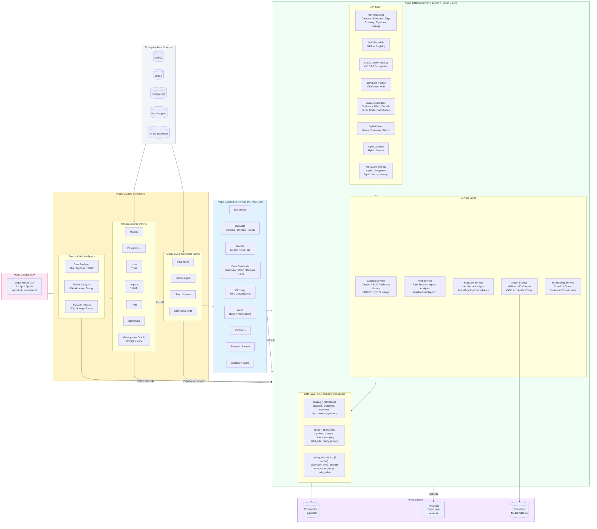
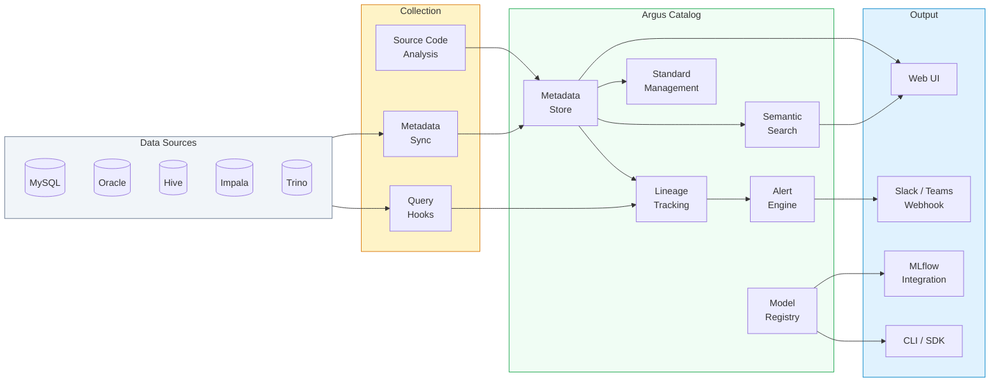
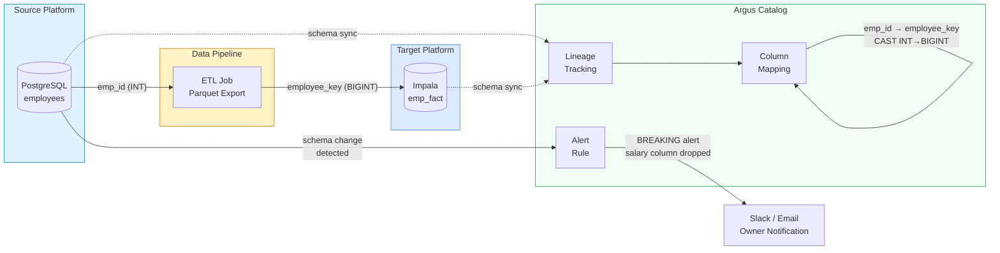
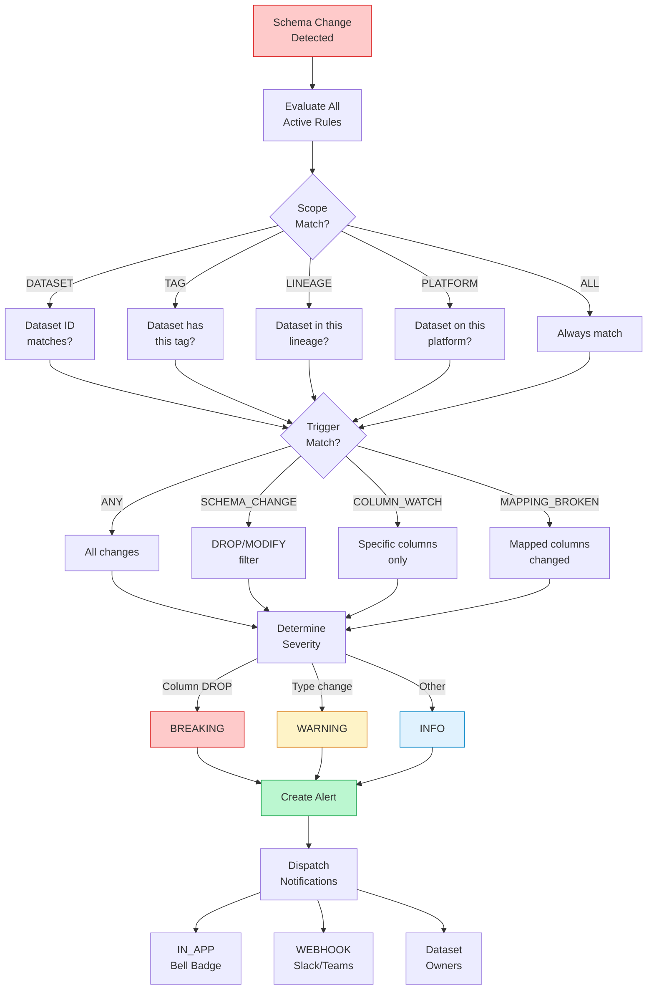
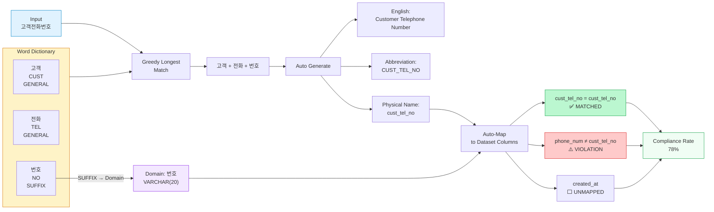
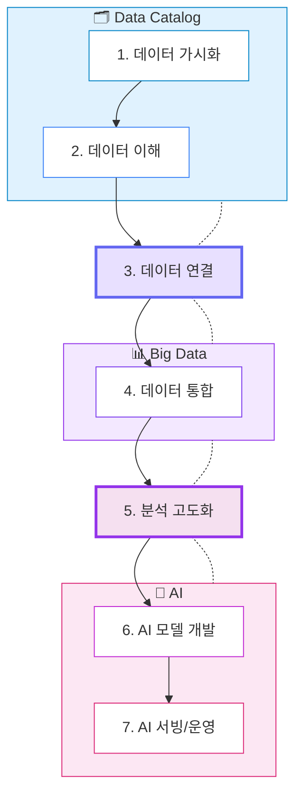

# Argus Catalog Architecture

## System Architecture

## Data Flow

## Cross-Platform Lineage

## Alert Rule Engine

## Data Standard - Morpheme Analysis

## AI Journey - Enterprise Data to AI

